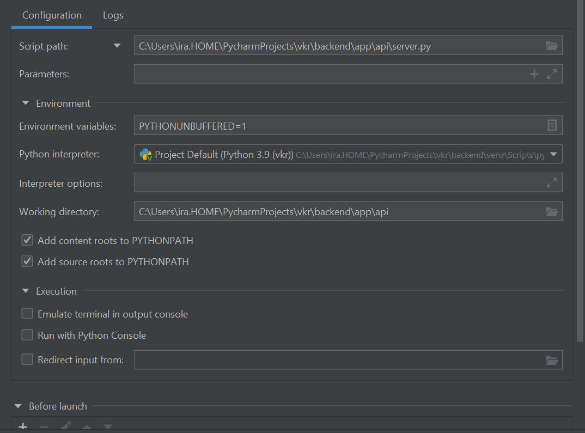
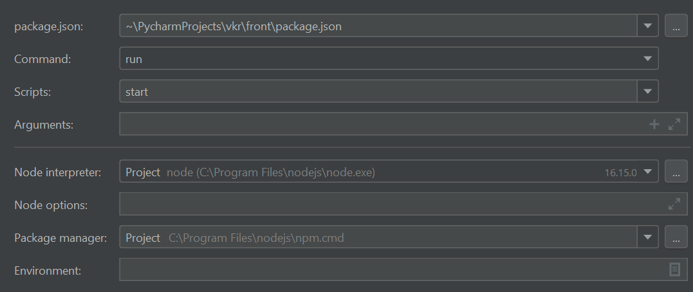

# Требование к проекту

- База данных : MySQL версии 8.0 и выше
- Python 3.9
- Node js v16.15.0

# Настройка проекта

1) База данных

- Настроить сервер MySQL
- Выполнить скрипты в папке ./sql

2) Бэкэнд

- Перейти в директорию ./backend

```commandline
cd ./backend
```

- *Дополнительно*: Настроить виртуальное окружение python

- Установить зависимости для бэкэнда
- ```commandline
  pip install -r requirements.txt
  ```
  
- Заполнить свои значения в файле ./.env

3) Фронтэнд

- Перейти в папку ./front

- Выполнить команду 
```commandline
npm install
```

5) Запуск

Запуск производился в IDE Pycharm 2022.1.1 (Professional Edition)

Добавлены конфигурации запуска для фронта и бэка

- Бэк


- Фронт


